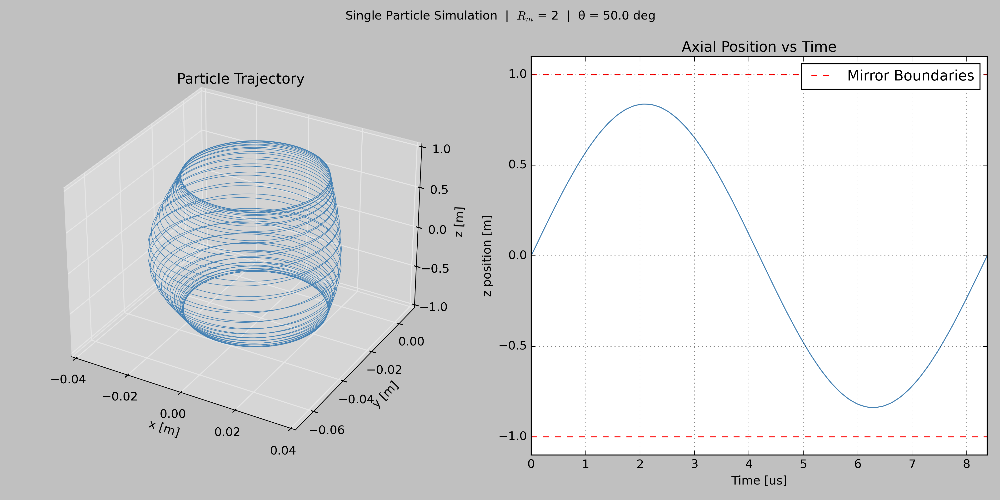

# TACOMAX - Trajectory and Confinement Of Magnetized Adiabatic eXcursions
TACOMAX is a physics simulation for modeling the trajectory and confinement of charged particles under various magnetic field conditions. It is currently being built in multiple milestones that map to the history of fusion confinement concepts.

## Milestone 1 - Magnetic Mirrors
Magnetic mirrors were one of the earliest fusion confinement concepts. They attempt to confine particles by reflecting them between two high strength coils. These machines fail because of the loss cone -- a region in velocity space from which particles inevitably escape the mirror. This milestone visualizes the loss cone, and quantifies how mirror ratio affects the confinement ability of a magnetic mirror.

### Physics
governing equations to be populated

### Simulation Approach
to be populated

### Results
Below is a plot of a single particle trajectory. The left subplot shows the trajectory in 3D space, where is traces a helical path as it bounces between the mirror coils (located at z = ±1 m). The right subplot shows the z position of the particle as a function of time. This plot shows a strong oscillatory motion as the particle is confined and reflected in the magnetic mirror.

Below are plots showing the loss cone for mirror ratios of 1.5, 2, 3, 5, and 10. Each plot shows escaped vs reflected particles as a function of pitch angle ($\theta$). The step in simulation outcome being located very close to the analytic critical pitch angle ($\theta_c$) confirms the simulation is correctly identifying the loss cone boundary. The error in critical pitch angle can be seen at the top of each plot, with the max error being 1.3% for $R_m$ = 10. The sequence of plots also shows that the critical pitch angle decreases as the mirror ratio increases. This visualizes how confinement improves at higher mirror ratios, albiet with diminishing returns.

$R_m$ = 1.5:

$R_m$ = 2:

$R_m$ = 3:

$R_m$ = 5:

$R_m$ = 10:

Below is a plot comparing the simulated and analytic critical pitch angles. Close agreement at the simulated mirror ratios further validates simulation accuracy. This plot is also a good visualization of improved confinement at higher mirror ratios.

### Validation
to be populated

### Limitations
to be populated
